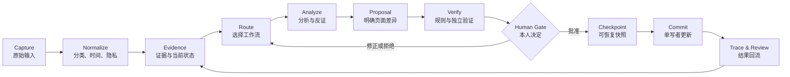

# Myself — Agent-native Personal OS

> 一个主要面向 18–25 岁关键转折期用户，以多路径探索、现实证据、低成本原型和本人决策为核心的生涯与人生规划框架。可以作为 Obsidian vault 使用，也可以让 Codex、Claude Code、Cursor 或其他能够读写本地 Markdown 的 Agent 协助运行。

Myself 不是替你生成一份看起来完整的“五年计划”。它把人生规划设计成一个可迭代系统：先认识现实与自己，再形成方向，用低成本实验验证，最后根据证据调整。

## 适合谁

主要服务于约 18–25 岁、愿意思考并采取小型现实行动的年轻人，特别是：

- 从高中进入大学，正在选择专业、训练路径或间隔年的人；
- 大学期间开始思考实习、研究、就业或继续升学的人；
- 大学或研究所毕业，准备进入职场的人；
- 初入职场后发现原方向不适合，准备重新探索的人。

年龄不是硬性限制，而是本项目默认问题和示例的设计中心。它不是职业测评、职位推荐器、心理治疗或危机服务。Agent 不会根据分数宣布“最适合你的人生”。

## 希望用户最后得到什么

不是终身答案，而是一项未来三年愿意投入、未来五年可以想象、未来 90 天能够开始的当前方向。它应包含选择理由、6–12 个月阶段目标、第一步、不做事项、不能牺牲的边界，以及未来改变方向的证据条件。

方向可以是专业、职业、能力组合、想解决的问题或生活方式，不必过早缩成一个职位名称。完整定义见[适用对象与预期成果](docs/audience-and-outcomes.md)。

## 它解决什么问题

- 把“当前事实”“感受”“解释”“假设”“决定”分开，避免愿望被误写成现实。
- 把模糊的人生目标转化为可验证的情景和阶段实验。
- 帮助经验尚少的用户区分本人方向、家庭／社会期待与未经验证的职业想象。
- 让 AI 能够参与整理、反证、复盘和规划，但不能替用户决定价值观。
- 保留每次重要变更的来源、批准、备份和结果，避免对话结束后失去上下文。
- 所有核心内容都是本地 Markdown；Obsidian 是推荐界面，不是运行前提。

## 核心调用链



详细说明见 [系统架构](docs/architecture.md) 与 [Agent 协作协议](docs/agent-protocol.md)。

## 5 分钟开始

需要 Python 3.9+，不依赖第三方包。

```bash
git clone https://github.com/3956ray/Myself.git
cd Myself
python3 scripts/init_vault.py ~/My-Personal-OS
```

然后：

1. 用 Obsidian 打开 `~/My-Personal-OS`；或直接用任意 Markdown 编辑器。
2. 让 Agent 在该目录工作，并发送：

   ```text
   请先阅读 AGENTS.md 和 99 系统/首次设置.md。
   只进行首次访谈和候选整理，不要把推断直接写成我的正式状态。
   ```

3. 按顺序开始：当前现实 → 工作观／人生观 → 投入与能量观察 → 人生罗盘 → 问题重构 → 奥德赛计划 → 原型 → 本人选择 → 三年战略 → 当前季度 → 第一次周复盘。
4. 运行结构检查：

   ```bash
   python3 "99 系统/scripts/validate_vault.py"
   ```

更完整的流程见 [快速开始](docs/getting-started.md)。

## 生涯与人生设计模型

框架不会从“你五年后想做什么”直接开始，也不会把奥德赛和三年战略当成两套互相竞争的规划。它依次处理：

1. **现实盘点**：资源、约束、责任、风险与当前节奏。
2. **工作观与人生观**：分别澄清工作的意义与人生的组织原则，寻找一致和冲突。
3. **投入与能量证据**：用多日观察区分活动、环境、人际和节奏信号。
4. **罗盘与问题重构**：形成冲突规则，并把“卡住”改写为可行动的问题。
5. **奥德赛计划**：并行构想三个不同的五年未来，不急着宣布唯一答案。
6. **现实原型**：通过信息访谈、跟岗、短课、小项目等便宜、快速、容易开始的行动减少关键未知。
7. **本人选择与三年战略**：选择、组合或新建路线，再把当前方向转为三年战略假设。
8. **执行与证据更新**：用年度、季度和复盘循环继续、停止或调整，而不是维护旧叙事。

详细衔接见 [奥德赛计划如何接入 Personal OS](docs/odyssey-plan.md)。官方方法与本项目扩展的边界记录在生成 vault 的 `99 系统/奥德赛方法与来源.md`。

## 仓库结构

```text
.
├── docs/                 # 架构、决策模型、Agent 与 Obsidian 指南
├── scripts/              # 初始化器与只读校验器
├── tests/                # 标准库测试
└── vault-template/       # 不含个人数据的 Personal OS 模板
    ├── 00 收件箱/         # 未验证输入
    ├── 01 基础/           # 当前状态、人生维度、工作观／人生观、罗盘
    ├── 02 战略/           # 问题重构、奥德赛、三年战略、年度主题
    ├── 03 季度/           # 当前季度计划与入口
    ├── 04 复盘/           # 日、周、月、季、年回顾
    ├── 05 日志/           # 投入与能量、证据、决策、变更、运行记录
    ├── 06 实验/           # 可证伪的现实实验
    ├── 90 模板/           # 可复制的记录模板
    └── 99 系统/           # 数据契约、调用链和安全规则
```

## 设计边界

- AI 是分析者和协作者，不是人生价值的最终裁判。
- 分数、矩阵和模型只用于暴露假设，不制造“客观最优人生”。
- 财务、医疗、法律和其他高风险问题必须使用权威来源或专业人士。
- 不要在 vault 中保存密码、私钥、助记词、完整证件号码或第三方敏感信息。
- 本项目不是医疗、法律、投资或心理治疗服务。

## 开发与验证

```bash
python3 -m unittest discover -s tests -v
python3 scripts/validate_vault.py --vault vault-template --template-mode
```

项目采用 [MIT License](LICENSE)。当前版本为早期可用版本，欢迎通过 Issue 提交使用反馈。
