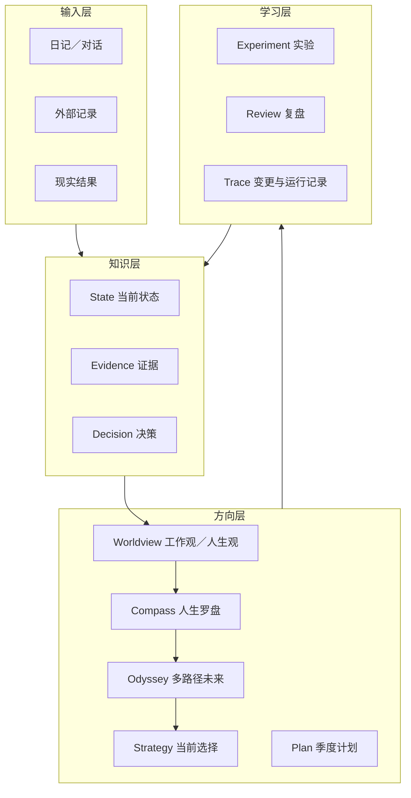

# 系统架构

## 1. 框架与个人实例分离

Myself 分为两层：

- **Framework**：公开仓库中的结构、协议、模板、初始化器和校验器。
- **Instance**：用户初始化后得到的私人 vault，是用户自己的唯一正式状态源。

框架可以公开，实例默认私有。聊天、网页、日历、项目管理器和可穿戴设备只是输入源，不能自动覆盖正式状态。

框架的默认用户与成果定义见[适用对象与预期成果](audience-and-outcomes.md)：重点服务教育与早期生涯转折，通过引导和现实原型形成可行动、可调整的 3–5 年方向。

## 2. 四层数据模型

### Canonical 与 Derived

- `01 基础/`、`02 战略/`、`03 季度/` 是正式方向与状态。
- `05 日志/` 保存追加式证据、决策和变更，不覆盖历史。
- `00 首页.md` 是派生导航，避免复制大量会变化的数据。
- `00 收件箱/` 是候选输入，不代表用户已经同意。

## 3. Graph of Loops 调用链

### 主链

1. **Intake**：接收原始记录、来源与发生时间。
2. **Normalize**：区分事实、感受、解释、假设和决定；补充时间范围与隐私级别。
3. **Evidence/State**：连接已有证据，标出冲突与缺失。
4. **Route**：根据任务选择 Capture、Review、Decision、Research 或 High-risk 流程。
5. **Analyze**：分析变化、反证、替代解释和风险；必要时使用只读 Worker。
6. **Reduce**：检查预期输入是否齐全，确定性去重，保留冲突。
7. **Proposal**：列出目标页面、字段级差异、证据、验收和回滚条件。
8. **Verify**：先运行确定性规则；涉及判断时使用隔离上下文的 Verifier。
9. **Human Gate**：本人批准、修正或拒绝明确范围。
10. **Checkpoint**：创建可恢复快照并记录哈希或版本。
11. **Commit**：只有一个 Writer 串行修改批准内容。
12. **Trace/Eval**：再次验证，记录实际差异，并在约定日期复查现实结果。

### 为什么是循环而不是瀑布

- 目标会随着经验改变，但改变需要证据，而不是一天的情绪。
- 计划的价值来自现实反馈，不来自文档完整度。
- 决策在复查日期回流为新证据，影响状态、战略或下一轮实验。
- 任一节点都可以因证据不足、隐私风险或范围错误而退回。

## 4. Agent 角色

| 角色 | 责任 | 禁止事项 |
|---|---|---|
| Root Orchestrator | 明确目标、范围、输入版本并综合结果 | 替用户决定价值观 |
| Read-only Worker | 对独立领域做限定分析 | 写入共享 vault 或扩大范围 |
| Verifier | 只检查 Claim、Evidence、时效与验收条件 | 阅读分析者的整段自我辩护 |
| Human Gate | 决定价值、优先级、风险和是否写入 | 把批准责任交给模型 |
| Writer | 按批准差异串行更新 | 修改范围外文件 |

默认使用一个强 Root。只有两个以上子任务真正独立、材料较多且结果可确定性合并时才并行。

## 5. 不变量

系统的可靠性依赖以下不变量：

1. 当前事实与未来目标不能使用同一时间语义。
2. 模型输出不能独立成为事实证据。
3. 候选输入不能未经本人批准进入正式状态。
4. 重要写入必须可恢复、可追溯并限定范围。
5. 历史结果只追加或被明确标记为 superseded，不静默改写。
6. 高风险建议必须连接权威来源或专业人士。
7. 奥德赛评分只能暴露问题，不能自动决定用户应选择的路线。
8. 三年战略必须说明它承接了哪项本人选择及哪些原型证据。
9. 升学、专业与第一份工作选择不能被写成用户不可改变的永久身份。
