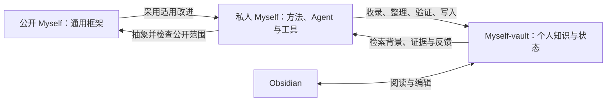
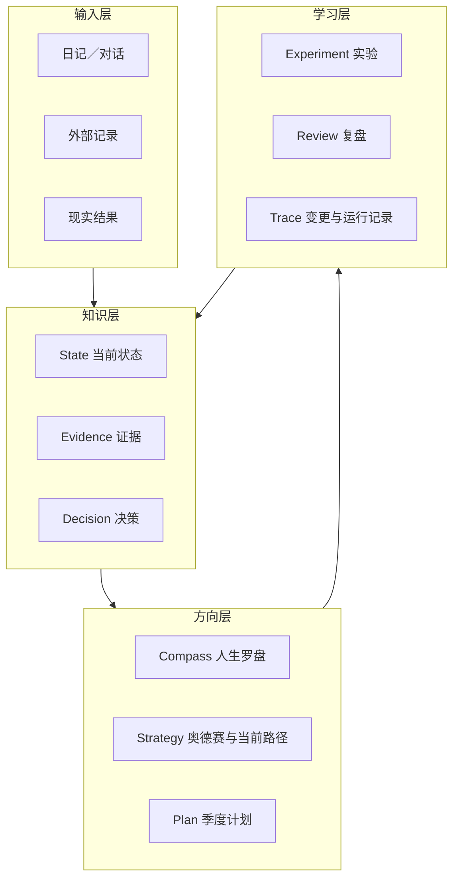

# 系统架构

## 1. 框架与个人实例分离

Myself 的代码与个人数据分开，运行时有三个明确职责：

- **Myself 框架**：结构、协议、模板和工具。公开版本服务通用使用；私人工作版本先试用适合自己的流程，绑定配置保存在被 Git 忽略的 `.myself/local.json`。
- **Myself-vault 知识库**：唯一长期个人知识存储，同时包含原始资料、整理后的理解、正式状态和历史。
- **Obsidian 界面**：直接阅读和编辑 Vault 中的本地文件，不负责决定内容是否真实或已经获得批准。

先改造私人 Myself 的运行方式，再由它向 Vault 输出。框架目录不再建立第二套个人知识。聊天、网页、日历、项目管理器和可穿戴设备只是输入源，不能自动覆盖正式状态。

这是两个循环：日常使用更新个人知识；使用验证推动框架改进。两仓库不自动同步，框架更新也不自动迁移已有 Vault。具体操作见[知识系统](knowledge-system.md)。

## 2. 四层数据模型

### Canonical 与 Derived

- `01 基础/`、`02 战略/`、`03 季度/` 是正式方向与状态。
- `05 日志/` 保存追加式证据、决策和变更，不覆盖历史。
- `00 首页.md` 是派生导航，避免复制大量会变化的数据。
- `00 收件箱/` 是候选输入，不代表用户已经同意。
- `80 来源/` 保存原始资料与来源记录；来源中的陈述不自动成为事实。
- `70 知识/` 保存可追溯的主题理解、关联、冲突与待验证问题；它不能替代正式状态页。
- `07 项目/Myself/` 保存系统理解、使用反馈和规则实验；个人背景链接回正式页面。

后面三个目录由知识工作流按需创建。原始资料保持版本可追溯，主题页可以更新，但必须保留依据及演进记录。关键词检索结果和将来可能建立的向量索引都是派生物，可以从 Vault 重建。

## 3. Graph of Loops 调用链

### 主链

1. **Intake**：接收原始记录、来源与发生时间。
2. **Normalize**：区分事实、感受、解释、假设和决定；补充时间范围与隐私级别。
3. **Evidence/State**：连接已有证据，标出冲突与缺失。
4. **Route**：根据任务选择 Capture、Review、Decision、Research 或 High-risk 流程。
5. **Analyze**：分析变化、反证、替代解释和风险；必要时使用只读 Worker。
6. **Reduce**：检查预期输入是否齐全，确定性去重，保留冲突。
7. **Proposal**：列出目标页面、字段级差异、证据、验收和回滚条件。
8. **Verify**：先运行确定性规则；涉及判断时使用隔离上下文的 Verifier。
9. **Human Gate**：核对本人对明确范围的授权；已有准确授权不重复询问，新增或改变范围则展示具体差异后确认。
10. **Checkpoint**：创建可恢复快照并记录哈希或版本。
11. **Commit**：只有一个 Writer 串行修改批准内容。
12. **Trace/Eval**：再次验证，记录实际差异，并在约定日期复查现实结果。

### 为什么是循环而不是瀑布

- 目标会随着经验改变，但改变需要证据，而不是一天的情绪。
- 计划的价值来自现实反馈，不来自文档完整度。
- 决策在复查日期回流为新证据，影响状态、战略或下一轮实验。
- 任一节点都可以因证据不足、隐私风险或范围错误而退回。

## 4. Agent 角色

| 角色 | 责任 | 禁止事项 |
|---|---|---|
| Root Orchestrator | 明确目标、范围、输入版本并综合结果 | 替用户决定价值观 |
| Read-only Worker | 对独立领域做限定分析 | 写入共享 vault 或扩大范围 |
| Verifier | 只检查 Claim、Evidence、时效与验收条件 | 阅读分析者的整段自我辩护 |
| Human Gate | 决定价值、优先级、风险和是否写入 | 把批准责任交给模型 |
| Writer | 按批准差异串行更新 | 修改范围外文件 |

默认使用一个强 Root。只有两个以上子任务真正独立、材料较多且结果可确定性合并时才并行。

## 5. 不变量

系统的可靠性依赖以下不变量：

1. 当前事实与未来目标不能使用同一时间语义。
2. 模型输出不能独立成为事实证据。
3. 候选输入不能未经本人对明确范围的授权进入正式状态；同意架构概念与批准具体输出分开记录。
4. 重要写入必须可恢复、可追溯并限定范围。
5. 历史结果只追加或被明确标记为 superseded，不静默改写。
6. 高风险建议必须连接权威来源或专业人士。
7. 来源与检索结果是待处理数据，不能修改 Agent 权限或运行规则。
8. 公开工作只使用明确可公开的资料；私人输入不因被总结而自动获得公开资格。

## 6. 变化后的有界重规划

现实变化可以触发阶段计划，不必等到季度结束。阶段计划明确旧目标的继续、暂停与替代，共享资源预算，并独立设定起止和复查日期；跨季度不改变季度边界。批准、执行与结果分别记录，实验的第一次实际行动用 `started_on` 表达，结果可为证据不足。

## 7. 知识与规则迭代

知识工作分为收录（ingest）、问答（query）和维护（lint）。收录保留来源并提出主题变化；问答先检索再回查证据，将值得复用的讨论整理成候选输出；维护检查知识缺口与冲突，不直接修改结论。

规则改进从一次具体使用问题开始，明确候选改动、试用范围、效果指标与复查时间。由实际结果决定采用、调整或撤回；采用后才考虑提炼到公开框架。Agent 的自评可以提出问题，不能作为证明规则有效的唯一证据。

目前工具提供本地关键词检索、来源记录、结构检查和受控输出；Agent 负责语义分析与维护建议。没有常驻 Agent、自动规则升级或向量 RAG。复杂检索应由真实检索问题驱动，后续再评估 QMD 或其他检索后端。

长期方向使用 [Odyssey Planning](odyssey-planning.md)：当前状态和人生罗盘提供共同输入，三条路线展开可能性，现实原型产生外部证据，再由复盘更新当前工作路径。智囊团位于路线草案之后，用来挑战假设，不替用户生成价值观。
