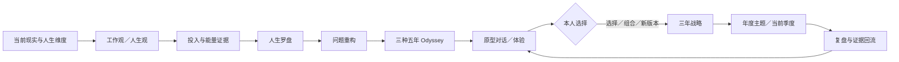

# 奥德赛计划如何接入 Personal OS

Myself 把奥德赛计划放在“认识现实与自己”之后、“三年战略与季度执行”之前。它不是三年战略的竞争模型：奥德赛负责扩大可能性并产生待验证方向，三年战略负责承接本人现阶段选定的方向。

## Agent 的正确角色

Agent 可以：

- 逐次提问并区分事实、感受、解释和假设；
- 发现三条计划过度相似、只写职业或继承社会脚本；
- 把未知转换为便宜、快速、容易开始的原型；
- 整理支持与反对证据，并提醒样本偏差和高风险边界。

Agent 不可以：

- 根据分数宣称某条路线客观最优；
- 替用户编写价值观、人生意义或最终选择；
- 把幻想写成事实，或用一次访谈代表整个行业；
- 把辞职、迁居、借贷或其他难逆动作包装成低成本原型。

## 完成标准

完成奥德赛工作流，不等于写完三个故事，而是已经：

1. 形成三个都值得认真考虑的五年版本；
2. 识别跨计划反复出现的元素与关键未知；
3. 至少完成两次原型对话和一次原型体验，或记录无法进行的理由；
4. 本人选择当前要继续验证的方向，并保留替代路径；
5. 将其转成可在未来三年和本季度观察的战略假设。

方法依据与官方链接见 vault 中的 `99 系统/奥德赛方法与来源.md`。
