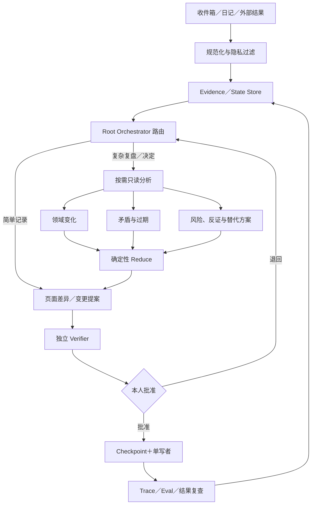

# 工作流地图

## 总体架构

分类、日期、完整性、链接、计算和 Checkpoint 应优先由确定性规则完成，不是每个节点都需要 Agent。

## 路由规则

| 触发 | 工作流 | 是否并行 |
|---|---|---|
| 临时事实或想法 | Capture | 否 |
| 现实变化使原计划失效 | 阶段重规划 | 通常否 |
| 普通周复盘 | Weekly Review | 通常否 |
| 月／季／年度复盘 | Period Review | 材料多时可按维度只读并行 |
| 重要个人决定 | Decision | 可按选项、风险和反证并行 |
| 外部研究 | Research | 可按独立问题并行 |
| 财务、医疗、法律、难逆动作 | High-risk | 权威来源＋Verifier＋本人门控 |

## 节点契约

| 节点 | 输入 | 输出 | 失败条件 |
|---|---|---|---|
| Intake | 原始记录、来源、时间 | 候选事实／感受／解释 | 来源或时间完全未知 |
| Normalize | Intake、时间、隐私 | 分类、去重的输入 | 当前与未来混合或未脱敏 |
| Worker | 只读范围、验收标准 | 发现与证据引用 | 扩大范围、缺证据、尝试写入 |
| Reduce | 预期输入数量与输出 | 去重、冲突、缺失清单 | 输入缺失却继续综合 |
| Proposal | 合并发现与原目标 | 页面差异和最多三个行动 | 泛泛建议、没有实际差异 |
| Verifier | Claim、Evidence、时间、验收 | 验证状态和可复查原因 | 来源无法复查或推断冒充事实 |
| Human Gate | 提案、风险、恢复方式 | 批准、修正或拒绝 | 没有本人明确决定 |
| Commit | 批准范围、Checkpoint | 串行更新与日志 | 超范围、校验失败、无法恢复 |

## 核心流程

- **Capture**：原始输入 → 分类／脱敏 → 证据候选 → 本人确认 → 日志或目标页。
- **Weekly Review**：本周记录 → 支持／反对证据 → 风险与缺失 → 最多三个行动 → 必要时提案。
- **Quarterly Review**：冻结同一版本输入 → 六维分析 → 继续／停止／调整 → 新季度候选结果。
- **Decision**：现实约束 → 选项／机会成本／可逆性／事前验尸 → 最小实验 → 本人决定 → 结果回流。

- **阶段重规划**：关键前提变化 → 证据与受影响目标 → 有界计划与共同预算 → 验证与批准 → 执行复查。详见[[99 系统/阶段重规划]]。
